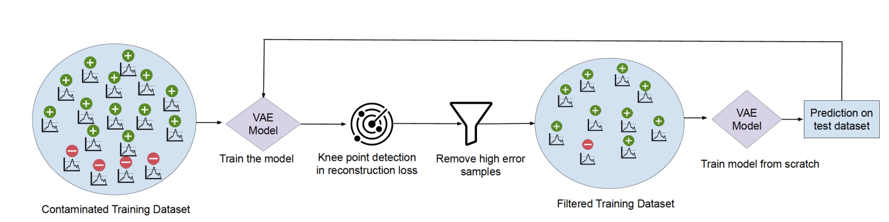

# Refine: A Robust Approach to Unsupervised Anomaly Detection for Production HPC Systems



## Overview

**Refine** is a robust unsupervised anomaly detection framework designed to detect performance anomalies in High-Performance Computing (HPC) systems, even when training data is contaminated with anomalies. Traditional unsupervised methods assume anomaly-free training datasets, but real-world HPC data is often contaminated by factors such as shared resource contention, software bugs, or hardware failures. Refine addresses this challenge through an iterative filtering mechanism that progressively refines the training dataset by removing high-error samples based on reconstruction errors from a Variational Autoencoder (VAE).

## Key Features

- **Robust to Data Contamination**: Achieves an F1-score of 0.88 even with up to 10% anomalies in the training dataset
- **Unsupervised Learning**: No labeled data required for training
- **Iterative Refinement**: Progressively improves model performance by removing high-error samples
- **Model-Agnostic**: Can be adapted to any reconstruction loss-based anomaly detection method

## How It Works

Refine uses a VAE-based approach with the following key innovations:

1. **Knee Point Detection**: Identifies the epoch where the model starts to overfit anomalous samples
2. **Iterative Filtering**: Removes samples with reconstruction errors exceeding the 95th percentile threshold
3. **Progressive Refinement**: Retrains the model on the refined dataset until desired accuracy is achieved

The framework exploits the observation that anomalous samples exhibit higher reconstruction errors than healthy samples, especially during early training stages.

## Repository Structure
- `job_scripts/` - HPC job submission scripts for running experiments
- `scripts/` - Core implementation scripts including the Refine framework

## Performance

- **F1-Score**: 0.88 with 10% training data contamination (Eclipse dataset)
- **Outperforms**: State-of-the-art methods including Prodigy, Isolation Forest, LOF, NegCo, LOE, NCAE, and IAD

## Citation

If you use Refine in your research, please cite our paper:

```bibtex
@inproceedings{sencan2025refine,
  title={Refine: A Robust Approach to Unsupervised Anomaly Detection for Production HPC Systems},
  author={Sencan, Efe and Lee, Yin-Ching and Casey, Connor and Schwaller, Benjamin and Leung, Vitus J and Brandt, Jim and Kulis, Brian and Egele, Manuel and Coskun, Ayse K},
  booktitle={ISC High Performance 2025 Research Paper Proceedings (40th International Conference)},
  pages={1--12},
  year={2025},
  organization={Prometeus GmbH}
}
```

**Paper Link**: [IEEE Xplore](https://ieeexplore.ieee.org/abstract/document/11018307)

## Requirements

- Python 3.6+
- TensorFlow 2.6.2
- TSFRESH for feature extraction
- NumPy, Pandas, Scikit-learn

## Usage

Submit jobs using the provided HPC job scripts:

```bash
# Example: Submit iterative Refine job
qsub job_scripts/submit_iterative_refine.sh
```

Run scripts directly:

```bash
# Example: Run Refine
python scripts/refine.py [arguments]
```

## Authors

- **Efe Sencan** - Boston University
- **Yin-Ching Lee** - Boston University
- **Connor Casey** - Boston University
- **Benjamin Schwaller** - Sandia National Laboratories
- **Vitus J. Leung** - Sandia National Laboratories
- **Jim Brandt** - Sandia National Laboratories
- **Brian Kulis** - Boston University
- **Manuel Egele** - Boston University
- **Ayse K. Coskun** - Boston University

## Acknowledgments

This work was conducted in collaboration with Sandia National Laboratories using the Eclipse and Volta HPC systems.

